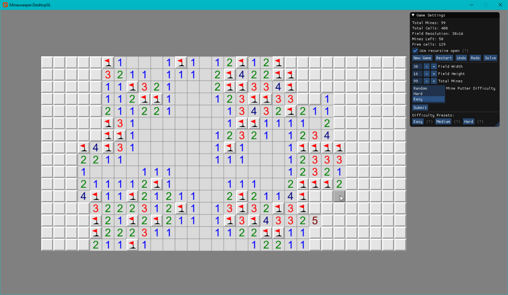

# Minesweeper

A minesweeper-like game

## Screenshot

## TODO

- [x] Simple minefield generation
- [x] Flags
- [x] Simple UI using ImGUI
- [x] Generate mines after first open cell
- [x] Easy mine generator (guaranteed that there will be no mines at the starting 3x3 square)
- [x] Open appropriate cells after clicking on a free cell with the number value
- [ ] Open appropriate cells recursively
- [ ] Add warnings if there are more flags around a cell than its number value
- [ ] Guess-free minefield generation
- [ ] More game settings
- [ ] Better UI
- [ ] Android version

## Dev Notes

Taken from here: https://stackoverflow.com/questions/1738128/minesweeper-solving-algorithm

The simplest algorithm is to place all of the mines randomly. (Make sure you don't overlap them!)

**Problem**: The player's first click might be a mine.

**Improvement**: Delay the generation of the grid until the user clicks on the first square, and don't put any mines in that square.

**Problem**: The player's first click might reveal a non-zero number, and they will be forced to click randomly until something opens up.

**Improvement**: Don't generate any mines in the (up to) eight squares around the first click, either.

**Problem**: The player might be forced to guess at some point, making this a sad excuse for a logic puzzle.

**Improvement**: Run the solver alongside the generator, making sure that the puzzle has a unique solution. This takes some cleverness, and isn't done in most variants.

Another, less common way to resolve ambiguities is to detect when the player knows they are choosing between equally likely possibilities and "collapse the waveform" into the position they decided on. I have never seen this in action, but it would be kind of fun.