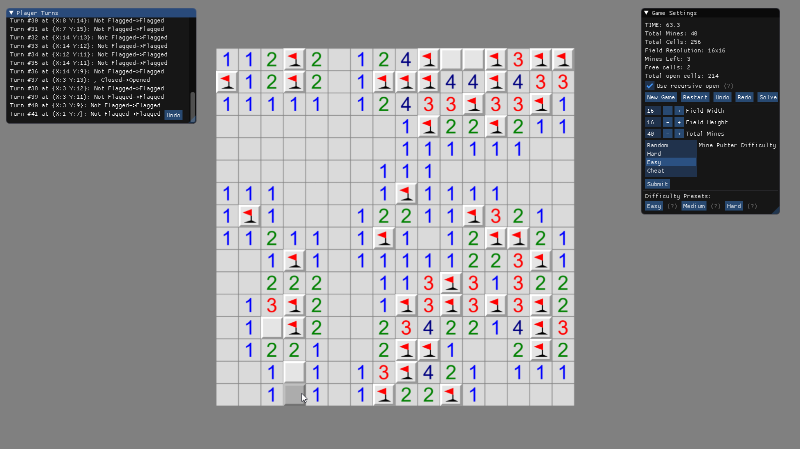

# Minesweeper

A minesweeper-like game written in C# using MonoGame.

The game is inspired by [Mines](https://www.chiark.greenend.org.uk/~sgtatham/puzzles/js/mines.html) from Simon Tatham's Portable Puzzle Collection.

## Build

In order to build the DesktopGL version of the project as well as the minesweeper framework, you'll need `.NET Core 3.1` or higher. Also you'll need [MonoGame](https://monogame.net) installed in order to build the game content. All the other required packages are referenced via NuGet:

 - ImGUI.NET
 - MonoGame.Extended

As soon as MonoGame and .NET Core are installed, go to the `./Source` directory and either run

```powershell
dotnet build 
```

to build Minesweeper, or

```powershell
dotnet run --project .\Minesweeper.DesktopGL\Minesweeper.DesktopGL.csproj
```

to run DesktopGL version of Minesweeper. You can also run Visual Studio and open `Minesweeper.sln`.

## Screenshot



## TODO and current roadmap

- [x] Simple minefield generation
- [x] Flags
- [x] Simple UI using ImGUI
- [x] Generate mines after first open cell
- [x] Easy mine generator (guaranteed that there will be no mines at the starting 3x3 square), maybe should reconsider the save field size
- [x] Open appropriate cells after clicking on a free cell with the number value
- [x] Add Timer
- [x] Add warnings if there are more flags around a cell than its number value
- [x] Show cells player tries to open 
- [ ] Fix known (and unknown) bugs:
  - [x] Mine field is empty after undoing the first action (on mine generation basically)
  - [x] Game time accumulates incorrectly
  - [x] Undo doesn't allow player to open cells if he caught a mine
  - [ ] The mine field is zooming if scrolling ImGUI windows
  - [ ] The grid which is drawn after clicking on any cell is pretty ugly
  - [ ] Restart doesn't work properly
  - [ ] Redo doesn't work at all
  - [ ] Solve function works incorrectly
  - [x] **You cannot win in current version**
- [ ] Implement auto flagging if there is an obvious pattern
- [ ] Make seeds work as expected
- [ ] Open appropriate cells recursively 
- [ ] Add local scores (SQLite will work well)
- [ ] Guess-free minefield generation
- [ ] Implement calculation of [3BV](http://www.stephan-bechtel.de/3bv.htm)
- [ ] Add saveable replays
- [ ] More game settings
- [ ] Better UI
- [ ] Add online scores
- [ ] Android version
- [ ] WebGL version

## Dev Notes

Taken from here: https://stackoverflow.com/questions/1738128/minesweeper-solving-algorithm

The simplest algorithm is to place all of the mines randomly. (Make sure you don't overlap them!)

**Problem**: The player's first click might be a mine.

**Improvement**: Delay the generation of the grid until the user clicks on the first square, and don't put any mines in that square.

**Problem**: The player's first click might reveal a non-zero number, and they will be forced to click randomly until something opens up.

**Improvement**: Don't generate any mines in the (up to) eight squares around the first click, either.

**Problem**: The player might be forced to guess at some point, making this a sad excuse for a logic puzzle.

**Improvement**: Run the solver alongside the generator, making sure that the puzzle has a unique solution. This takes some cleverness, and isn't done in most variants.

Another, less common way to resolve ambiguities is to detect when the player knows they are choosing between equally likely possibilities and "collapse the waveform" into the position they decided on. I have never seen this in action, but it would be kind of fun.